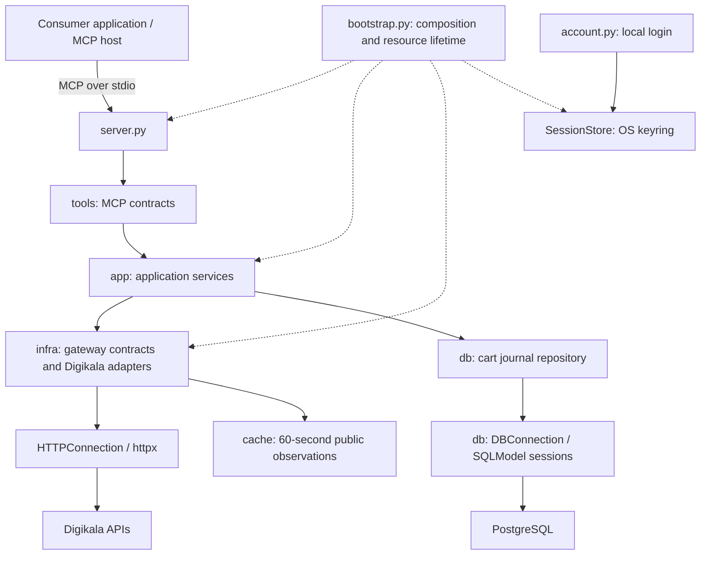

# digikala-mcp

A FastMCP server with Dishka dependency injection for Digikala product discovery, offer comparison, and bounded cart operations. Consumer applications own conversations, recommendations, user interfaces, and user approval; this project provides the underlying shopping operations.

## Installation

Requires Python 3.11 or newer.

```sh
python -m venv .venv
.venv/bin/python -m pip install -e .
```

Configure your MCP client to start the server over stdio:

```json
{
  "mcpServers": {
    "digikala": {
      "command": "/absolute/path/to/digikala-mcp/.venv/bin/fastmcp",
      "args": ["run", "/absolute/path/to/digikala-mcp/src/server.py:create_server", "--no-banner"]
    }
  }
}
```

Public catalog tools do not require an account. For cart operations, connect your account in an interactive terminal:

```sh
.venv/bin/digikala-account login
```

The account command stores the session in the operating system's keyring. Use `.venv/bin/digikala-account disconnect` to remove the saved session. Password login is supported; accounts requiring OTP or phone confirmation need that challenge resolved separately.

Cart writes require both `INCART_CART_MAX_TOTAL_RIAL` and `INCART_CART_MAX_ITEMS` in the server environment. These set the merchandise budget in rials and the total number of units. `DATABASE_URL` configures PostgreSQL persistence for cart plans and operations. Public catalog reads and account login do not require a database. Environment variables must be injected by the host; `.env` is not loaded automatically. The `INCART_` limit names are retained for compatibility.

Apply versioned database migrations before cart writes:

```sh
.venv/bin/alembic upgrade head
```

## Architecture



The request flow is `tools → app → infra`. Pydantic models define the contracts shared by these layers. `bootstrap.py` composes concrete dependencies and owns HTTP client lifetimes.

## Project structure

```text
src/
  models/
    schemas/              MCP input/output and domain contracts
    db/                   SQLModel table mappings and database constraints
    cache/                Internal cache entry models
  tools/                  MCP tool registration, schemas, and annotations
  app/
    catalog.py            Catalog orchestration and result normalization policies
    products.py           Product content, batch reads, specifications, and seller research
    cart_operations.py    Account-scoped journal inspection and read-back reconciliation
    comparison.py         Deterministic comparison of observed seller offers
    cart.py               Cart planning, limits, revalidation, and execution
  infra/
    http/                 Fixed-origin requests, authentication, and market gateways
      gateways/           Public catalog and authenticated cart adapters
    db/
      connection.py       Lazy PostgreSQL engine, pool, and SQLModel session factory
      repositories/       Typed queries and versioned cart state transitions
      exceptions.py       Independent database errors
      errors.py           Sanitized driver-error translation
    cache/                Bounded TTL cache with shared asynchronous requests
  config/                 Trusted local limits and database connection configuration
  providers/
    http.py               Public HTTP client and connection
    cache.py              Cache lifetime, finalized before the HTTP client
    gateways.py           Public gateway and authenticated gateway factories
    database.py           Database pool, scoped sessions, repositories, and commit boundaries
    catalog.py            Catalog and product services
    cart.py               Cart planning and replacement services
    accounts.py           Login and in-memory account sessions
    overrides.py          Explicit service overrides for embedded use and tests
  bootstrap.py            Provider graph composition
  server.py               FastMCP factory and lifespan; launched by the FastMCP CLI
  account.py              Local interactive account connection and disconnection
migrations/               Alembic environment and versioned PostgreSQL schema changes
alembic.ini               Migration configuration; connection comes from DATABASE_URL
tests/                    Unit, contract, lifecycle, and MCP integration tests
```

## Dependency injection and lifecycle

`create_server` returns a FastMCP 4 server. Its lifespan creates a Dishka container,
resolves application-scoped services before accepting requests, and closes the
container at shutdown. Providers under `providers/` own their respective resources:
HTTP, cache, gateways, database, catalog, cart, and accounts. `bootstrap.py` only
composes that graph. The cache depends on the public HTTP client so its pending
requests finish before that client closes.

Cart services share an application-scoped `JournalFactory`.
Each database phase opens a fresh Dishka `REQUEST` scope beneath the application
container. `AsyncSession` and `CartJournal` are shared within that scope and discarded
when it closes. Concurrent phases receive different sessions, including phases in
separate tasks serving the same account.

Tools declare their service using `Depends(from_dishka(ServiceType))`.
`tools/dependencies.py` bridges FastMCP's dependency contexts to Dishka request
scopes; injected service/container parameters are excluded from MCP input schemas.
Each tool call gets a request scope that closes on completion or failure. Shared
catalog/cache/account state stays application-scoped. Containers belong to each
server lifespan, with no module-global service registry or application mutex.

The bridge uses FastMCP's native dependency API rather than `dishka-fastmcp`, whose
current release requires FastMCP below version 4. Both FastMCP and Dishka are pinned
in `pyproject.toml`. Dependency lifetimes follow their official
[FastMCP](https://gofastmcp.com/servers/dependency-injection) and
[Dishka](https://dishka.readthedocs.io/en/stable/container/) contracts.

Tests and consumers can supply Dishka providers with explicit overrides. The
existing `catalog_factory`, `cart_service` and `account_service` injection hooks
also become provider overrides, preserving test and host integration seams.

`CatalogService` receives gateway instances through its constructor. `CartService` receives an authenticated gateway factory, a journal, and cart limits. Tests replace these dependencies with mock HTTP transports, synthetic gateways, and temporary storage.

The public catalog uses a Dishka-managed HTTP client. The cache is finalized before that client closes; account tool sessions are cleared on shutdown. Authenticated cart operations use separate clients loaded from the local account session. The local account command handles desktop login; trusted backend account tools provide a separate token-scoped login path described below.

## Catalog and comparison flow

Catalog tools request native Digikala pages and normalize products and seller offers into shared models. `list_offers` derives a seller listing cached for up to 60 seconds from the product detail response and can filter by an exact variant ID. Its coverage is limited to that response; it does not imply a complete list of all sellers. Prices are integer Iranian rials. Missing prices, availability, and shipping costs remain explicit unknowns.

`list_categories` reads Digikala's live category tree and returns actual search IDs, Persian and English titles, codes, parent IDs, and child indicators. It supports name/code/ID substring lookup, direct-child and root filters, and local pagination (50 items by default, at most 100). Persian/Arabic ی and ک and half-spaces are normalized for lookup. IDs are strings. The tree is cached for up to 60 seconds; it reflects upstream coverage and can contain references to missing parents.

For example, call `list_categories` with `{"query":{"query":"هندزفری"}}`, then `search_products` with `{"query":{"query":"انکر","category_id":"211"}}`. To browse without keywords, use `{"query":{"category_id":"211"}}`. To navigate the tree, use `{"query":{"roots_only":true}}` and then `{"query":{"parent_id":"5966"}}`. `autocomplete` also returns `category_id` for category suggestions.

Category filtering sends `categories[]` to the discovery search API and checks the returned category selection; an ignored or missing filter produces an error. Homepage menu IDs are not search category IDs. Use `list_categories` to discover the current identifiers.

Comparison resolves each distinct product from the public catalog cache, selects exact offer IDs, and computes price and attribute differences. It does not infer product equivalence from matching titles or substitute a different seller when an offer disappears.

## Cart flow and persistence

`prepare_cart_change` reads the cart, refreshes offers for increases, checks the configured amount and total-unit limits, and persists a five-minute plan without changing the remote cart. The consumer application presents that plan and obtains approval for the corresponding write tool.

`add_to_cart`, `update_cart_item`, and `remove_from_cart` map to POST, PATCH, and DELETE. Each executes only its matching plan. The service revalidates the session, cart, offer, and limits before writing, then reads the cart again to verify the outcome.

The journal records execution before the network mutation. Reusing a plan after a timeout or restart reconciles the result without resending the write. A PostgreSQL partial unique index allows one executing or uncertain operation per account. Versioned compare-and-swap updates establish ownership before remote validation and mutation. No application mutex, file lock, advisory lock, or explicit `SELECT FOR UPDATE` is used. PostgreSQL still performs its normal internal concurrency control. Unresolved outcomes prevent further changes for the same connection.

Session cookies live in the OS keyring. Plans and operation results live in the PostgreSQL JSONB journal. Neither passwords nor session cookies belong in that journal. Use the same `DATABASE_URL` across workers that operate on the same accounts. Existing SQLite files are not opened or silently discarded; their history must be migrated before reusing old operation IDs.

## Database ownership and error boundaries

`models/db/journal.py` maps the `cart_operations` table with SQLModel, including its
JSONB payload, revision, integrity checks and partial unique index. Public MCP schemas
remain in `models/schemas`; table instances are not returned by tools.

`infra/db/connection.py` owns the lazy engine, bounded pool, and SQLModel session
factory. Dishka provides one application-scoped `DBConnection` and disposes it at
shutdown. Missing database configuration does not prevent public catalog usage.

`infra/db/repositories/cart_journal.py` receives an `AsyncSession` through Dishka.
Its methods execute queries and flush writes; they never create or close sessions,
commit, or roll back. `providers/database.py` supplies the repository and session in
short scopes. Application services enter the injected journal factory around a database
phase. The factory commits on successful exit, rolls back on errors or cancellation,
and lets Dishka close the session. No unit-of-work or custom transaction class is used.

The execution-claim scope commits before the caller mutates the storefront cart.
The outcome is persisted in a separate scope afterward. No database session stays
open across storefront HTTP requests. A conditional update checks the
operation ID, account, state and revision in one SQL statement. The partial unique
index coordinates unresolved operations across processes without an application lock.

`infra/db/exceptions.py` defines independent configuration, availability, integrity
and operation errors. `infra/db/errors.py` strips driver messages and query parameters
at the database boundary. The provider translates recognized cart uniqueness
constraints into operation conflicts; `tools/errors.py` translates database errors
into safe MCP errors. Persistence imports neither HTTP errors nor cache code. A
persistence failure after a remote write is not reported as a rejected cart change;
the journal continues to block replay.

Alembic owns schema changes in `migrations/`; the application contains no `main`
function or `__main__.py`. FastMCP's CLI loads `server.py:create_server` directly.
Migration SQL is versioned separately from current SQLModel table definitions; request
handlers never create or migrate tables. Fresh databases use `alembic upgrade head`.
An existing journal whose schema matches baseline `0001_cart_journal` can be adopted
with `alembic stamp 0001_cart_journal`, followed by `alembic upgrade head`; stamping
records the baseline without changing existing rows. `DATABASE_URL` accepts PostgreSQL
URLs, including `postgresql+psycopg://`, and existing libpq connection strings.

## Architectural boundaries

Desktop cart tools serve one local keyring account over stdio. Trusted backend tools support isolated token-scoped accounts in the same process. Persistence uses SQLModel sessions over a SQLAlchemy async PostgreSQL engine with the psycopg 3 driver. Public remote authentication, OAuth, and regional workers are not implemented.

Approval is enforced by the trusted consumer application; a plan ID is not proof of human approval. Cart limits apply to merchandise totals and unit counts before increases. Digikala can still change prices or cart contents concurrently, so results are checked after each mutation and cannot provide an atomic upstream budget guarantee.

Login, account-scoped addition, deletion/replacement and populated-cart reads have live evidence from the consumer integration. Controlled tests additionally cover multiple accounts, expiry, partial failure, replay and exact offer checks. Payment, order placement, and address selection are outside the service boundary.

## Development

```sh
.venv/bin/python -m pip install -e '.[dev]'
.venv/bin/pytest -q
.venv/bin/ruff check src tests
.venv/bin/pyright
```

Tests use mock transports and synthetic account responses; they do not require a live account. Database tests use isolated schemas in `TEST_DATABASE_URL`, or start and stop a temporary local PostgreSQL instance when server binaries are available. They never use `DATABASE_URL` implicitly. If neither test option is available, PostgreSQL tests are explicitly skipped.

## License

This project is licensed under the [MIT License](LICENSE).

## Trusted backend account sessions

Backend hosts can use `login_account` with a private username/password DTO. The
result contains an opaque, process-local token with a 15-minute lifetime; the
upstream cookies stay in memory. `read_account_cart`, `replace_account_cart` and
`logout_account` use this token and never fall back to the desktop keyring.
Credentials and tokens must stay outside LLM prompts, model tool conversations,
application message queues and logs. Password challenges return a fixed outcome;
OTP handling is not implemented. The host owns encrypted credential persistence,
user authentication, ownership checks and explicit cart-replacement authorization.

`replace_account_cart` accepts a request UUID, one to three exact product/offer/
seller selections with expected prices, and a total merchandise budget. All
selected offers are refreshed before removing any existing items. The configured
host amount/unit limits still apply. Each selection adds one unit. The result is
`applied`, `rejected` or `uncertain`, with a sanitized cart snapshot when available.
There is no payment or order-placement operation.

Replacement batches use the same PostgreSQL journal and account uniqueness constraint as
individual cart operations. Execution ownership is committed before the first remote write.
A retry returns the recorded result or reports an executing/interrupted operation without
resending it. Uncertain outcomes prevent subsequent replacement for that account.
An executing record is never automatically expired or reconciled by a second caller: its
owner may still be sending a remote write. Interrupted execution requires explicit recovery;
automatic takeover is not implemented. Point all workers at the same database.
Use a stable canonical username for a connection;
the journal account key derives from that exact username, not a verified global
provider account identifier. Tokens are not a remote public authentication API.

`get_trend_snapshot` exposes the current homepage best-selling products in upstream
order with an observation timestamp. It does not invent a sales period, sales
counts or historical growth. Historical analysis needs multiple stored snapshots.

## Public product research and caching

Public gateway results are cached in memory for 60 seconds from successful completion,
with at most 256 entries per server process. Hash maps index normalized method arguments,
including IDs, page, sort, query and location. Concurrent identical calls await one shared
asyncio task without a mutex. Cache hits return independent copies and preserve the original
`observed_at`; errors are not cached, and an expired entry is not used after a refresh failure.
Closing the catalog cancels outstanding shared requests before closing its HTTP client.
This cache is process-local; it does not coordinate independent MCP processes.
Authenticated cart reads, price revalidation, login and mutations never use this cache.

| Tool | Source and responsibility |
| --- | --- |
| `get_product_variants` | Dedicated variants endpoint; exact offer IDs, attributes and sellers |
| `get_product_variant_types` | Observed dimension/value IDs grouped from the variants snapshot |
| `get_product_reviews` | One native review page with sort, buyer flags and 0–5 scores |
| `get_product_questions` | One question page with included answers and original date text |
| `get_product_ratings` | Product-level 0–100 scores, distribution and feedback counts |
| `list_product_sellers` | Seller IDs and metrics grouped with their distinct offers |
| `compare_product_sellers` | Compare 2–6 exact offer IDs for the same product |
| `list_product_recommendation_sections` | Available upstream recommendation section keys |
| `get_product_recommendations` | A selected suggestion section in upstream order, including ad flags |

Variation dimensions and sellers use hash maps for grouping without conflating IDs that
share a label. Seller comparison preserves differences in color/size, warranty, price,
availability, seller metrics and shipment descriptions. Lead time is an observation, not a
delivery promise. Missing prices/shipping/ratings stay unknown. Seller coverage is limited
to the returned endpoint response. Recommendations come from the store and are not
personalized advice. User-generated review and question text is untrusted data; reviewer
account IDs, names and social profiles are omitted from the MCP projection.

## Research and account cart extensions

The server exposes 40 tools. `get_category_filters` projects observed brand, color palette,
and attribute IDs from a category's search response. `search_products` accepts only those
filter families, validates selected IDs against the category snapshot, and serializes them
using storefront query parameters. Hash maps index filter keys and options; selections are
normalized before caching. The upstream echoes category selection but does not reliably
acknowledge each individual filter, so that limitation is included in search results.

`get_products_batch` resolves 1–20 distinct products with bounded HTTP concurrency and
per-product errors. `compare_products` uses the same observations for 2–6 products and
builds a specification matrix keyed by product ID. It compares literal labels and values;
missing fields remain unknown, and no unit conversion, equivalence inference or ranking is
performed. `get_product_media` shares the detail cache and projects official image/video
links, deduplicated by URL. It neither downloads media nor performs visual matching.

`get_product_price_history` adapts the storefront price-chart contract, preserving original
calendar strings, missing prices, availability, seller labels and warranty text. It does not
infer exact offer IDs, interpolate missing days or forecast prices. The adapter has synthetic
contract coverage based on the public site's JavaScript. Live verification on 2026-09-28
returned HTTP 429; `list_markets` therefore still marks this capability as unknown. Errors
are reported explicitly and are not cached or retried automatically.

Token-scoped `prepare_account_cart_change`, `add_to_account_cart`,
`update_account_cart_item` and `remove_from_account_cart` use the same `CartService` as the
desktop flow. The account service binds the authenticated gateway at each call and shares
the PostgreSQL journal and trusted limits with replacement operations. Tokens never fall
back to the keyring. The host owns approval and keeps tokens outside model conversations.

`get_cart_operation` and `reconcile_cart_operation`, plus their account-token counterparts,
verify journal ownership before projecting status. Reconciliation reads the upstream cart
and updates an uncertain record with a versioned database transition; it never resends a
remote mutation. A mismatch remains uncertain and continues to block further changes.
Replacement records now include the expected selection and trusted limits so partial
batches can also be reconciled. Matching contents establish the current state, not which
actor caused it. Legacy replacement records without a selection require manual review.

Executing records remain owned by their executor even when a read-back currently matches.
These tools do not take over active or interrupted executing records: another worker may
still be sending a mutation. Process termination recovery for those records requires operator
investigation. No application locks or automatic expiry of execution ownership are introduced.
