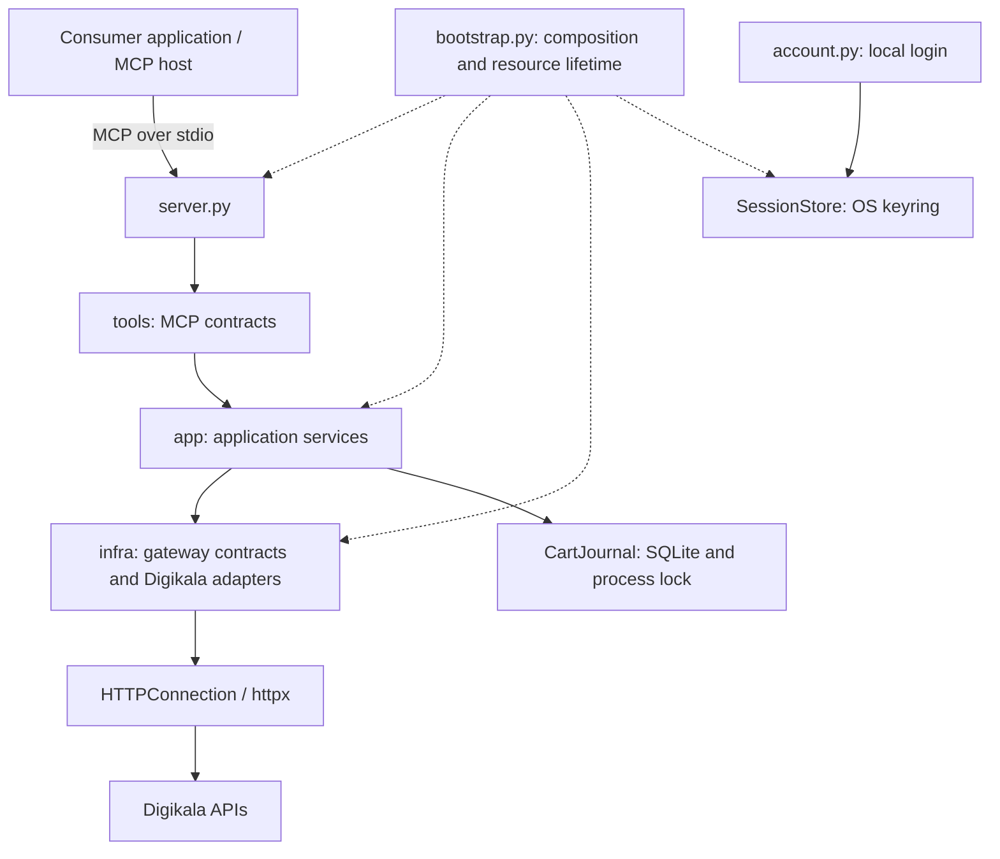

# digikala-mcp

A Python MCP server for Digikala product discovery, offer comparison, and bounded cart operations. Consumer applications own conversations, recommendations, user interfaces, and user approval; this project provides the underlying shopping operations.

## Installation

Requires Python 3.11 or newer.

```sh
python -m venv .venv
.venv/bin/python -m pip install -e .
```

Configure your MCP client to start the server over stdio:

```json
{
  "mcpServers": {
    "digikala": {
      "command": "/absolute/path/to/digikala-mcp/.venv/bin/digikala-mcp"
    }
  }
}
```

Public catalog tools do not require an account. For cart operations, connect your account in an interactive terminal:

```sh
.venv/bin/python -m src.account login
```

The account command stores the session in the operating system's keyring. Use `.venv/bin/python -m src.account disconnect` to remove the saved session. Password login is supported; accounts requiring OTP or phone confirmation need that challenge resolved separately.

Cart writes require both `INCART_CART_MAX_TOTAL_RIAL` and `INCART_CART_MAX_ITEMS` in the server environment. These set the merchandise budget in rials and the total number of units. `INCART_STATE_DIR` optionally changes the local journal directory. The `INCART_` names are retained for compatibility.

## Architecture



The request flow is `tools → app → infra`. Pydantic models define the contracts shared by these layers. `bootstrap.py` composes concrete dependencies and owns HTTP client lifetimes.

## Project structure

```text
src/
  models/                 Shared catalog, offer, comparison, and cart contracts
  tools/                  MCP tool registration, schemas, and annotations
  app/
    catalog.py            Catalog orchestration and result normalization policies
    comparison.py         Deterministic comparison of refreshed seller offers
    cart.py               Cart planning, limits, revalidation, and execution
    services.py           Application services exposed through the MCP lifespan
  infra/
    gateways/             Gateway interfaces and Digikala adapters
    http.py               Fixed-origin HTTP requests and normalized errors
    auth.py               Password login and independent session verification
    session.py            Session cookie storage in the OS keyring
    cart_journal.py       Durable operation records and cross-process locking
  config/                 Trusted local limits and state-directory configuration
  bootstrap.py            Dependency construction and resource ownership
  server.py               MCP entry point and lifespan
  account.py              Local interactive account connection and disconnection
tests/                    Unit, contract, lifecycle, and MCP integration tests
```

## Dependency injection and lifecycle

`create_server` accepts a catalog factory and an optional cart service. Its lifespan exposes a `Services` container through `Context[Services]`; tools delegate to the corresponding application service.

`CatalogService` receives gateway instances through its constructor. `CartService` receives an authenticated gateway factory, a journal, and cart limits. Tests replace these dependencies with mock HTTP transports, synthetic gateways, and temporary storage.

The public catalog uses a lifespan-managed HTTP client. Authenticated cart operations use separate clients loaded from the local account session. Passwords are handled by the local account command; MCP tools do not accept or return credentials.

## Catalog and comparison flow

Catalog tools request native Digikala pages and normalize products and seller offers into shared models. `list_offers` derives a fresh seller listing from the product detail response and can filter by an exact variant ID. Its coverage is limited to that response; it does not imply a complete list of all sellers. Prices are integer Iranian rials. Missing prices, availability, and shipping costs remain explicit unknowns.

`list_categories` reads Digikala's live category tree and returns actual search IDs, Persian and English titles, codes, parent IDs, and child indicators. It supports name/code/ID substring lookup, direct-child and root filters, and local pagination (50 items by default, at most 100). Persian/Arabic ی and ک and half-spaces are normalized for lookup. IDs are strings. The tree is refreshed for each call; it reflects upstream coverage and can contain references to missing parents.

For example, call `list_categories` with `{"query":{"query":"هندزفری"}}`, then `search_products` with `{"query":{"query":"انکر","category_id":"211"}}`. To browse without keywords, use `{"query":{"category_id":"211"}}`. To navigate the tree, use `{"query":{"roots_only":true}}` and then `{"query":{"parent_id":"5966"}}`. `autocomplete` also returns `category_id` for category suggestions.

Category filtering sends `categories[]` to the discovery search API and checks the returned category selection; an ignored or missing filter produces an error. Homepage menu IDs are not search category IDs. Use `list_categories` to discover the current identifiers.

Comparison refreshes each distinct product once per request, selects exact offer IDs, and computes price and attribute differences. It does not infer product equivalence from matching titles or substitute a different seller when an offer disappears.

## Cart flow and persistence

`prepare_cart_change` reads the cart, refreshes offers for increases, checks the configured amount and total-unit limits, and persists a five-minute plan without changing the remote cart. The consumer application presents that plan and obtains approval for the corresponding write tool.

`add_to_cart`, `update_cart_item`, and `remove_from_cart` map to POST, PATCH, and DELETE. Each executes only its matching plan. The service revalidates the session, cart, offer, and limits before writing, then reads the cart again to verify the outcome.

The journal records execution before the network mutation. Reusing a plan after a timeout or restart reconciles the result without resending the write. An application lock and a shared filesystem lock serialize local mutations. Unresolved outcomes block further changes for the same connection.

Session cookies live in the OS keyring. Plans and operation results live in a private SQLite journal. Neither passwords nor session cookies belong in that journal. State-directory and keyring identifiers are persistence contracts independent of the package name, preserving continuity across renames.

## Architectural boundaries

The current implementation serves one local account over stdio. Cart locking targets Linux and macOS. Remote multi-user identity, OAuth, and regional workers are not implemented.

Approval is enforced by the trusted consumer application; a plan ID is not proof of human approval. Cart limits apply to merchandise totals and unit counts before increases. Digikala can still change prices or cart contents concurrently, so results are checked after each mutation and cannot provide an atomic upstream budget guarantee.

Login and empty-cart reads have live evidence. Cart mutations and populated-cart parsing currently have synthetic contract tests and await live validation. Payment, order placement, and address selection are outside the service boundary.

## Development

```sh
.venv/bin/python -m pip install -e '.[dev]'
.venv/bin/pytest -q
.venv/bin/ruff check src tests
.venv/bin/pyright
```

Tests use mock transports and synthetic account responses; they do not require a live account.

## License

This project is licensed under the [MIT License](LICENSE).
