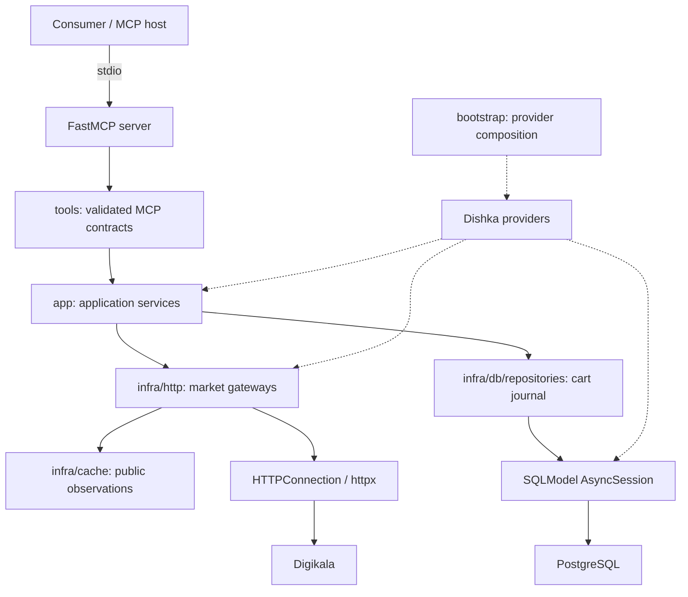

# digikala-mcp

An MCP server for Digikala product discovery, product research, offer comparison,
and bounded cart operations. Consumer applications own the conversation, product
selection, user interface, and approval of cart changes.

## Architecture



### Responsibilities

| Location | Responsibility |
| --- | --- |
| `src/server.py` | FastMCP factory, lifespan and tool registration; served over stdio. |
| `src/tools/` | Input/output contracts, tool descriptions, annotations and safe MCP errors. |
| `src/tools/dependencies.py` | Bridge FastMCP dependencies to Dishka scopes; injected services are absent from public input schemas. |
| `src/app/` | Catalog/research orchestration, comparisons, account sessions, cart planning, execution and reconciliation. |
| `src/infra/http/` | Fixed-origin HTTP requests, authentication, response normalization and market gateways. |
| `src/infra/cache/` | In-memory hash-map cache and shared tasks for identical public requests. |
| `src/infra/db/connection.py` | Lazy PostgreSQL engine, bounded pool and SQLModel session factory. |
| `src/infra/db/repositories/` | Queries and flushed writes on an injected session. |
| `src/infra/db/errors.py`, `exceptions.py` | Driver-error sanitization and independent persistence errors. |
| `src/models/schemas/` | Pydantic tool and application contracts. |
| `src/models/db/` | SQLModel table definitions, JSONB journal and database constraints. |
| `src/models/cache/` | Internal cache-entry models. |
| `src/providers/` | Separate HTTP, cache, gateway, database, catalog, cart and account providers, plus explicit overrides. |
| `src/bootstrap.py` | Compose the provider graph. |
| `src/config/` | Host-owned database connection and cart limits. |
| `migrations/` | Versioned Alembic schema changes, applied separately from request handling. |

### Dependency and session lifetime

The server owns one Dishka application container. HTTP clients, cache, database pool,
application services and in-memory account tokens live at application scope.
Each tool invocation gets a request scope. Cart services also receive an injected
`JournalFactory` that opens a separate, short Dishka scope for each database phase.

`CartJournal` receives an `AsyncSession`; it only queries and flushes. The database
provider commits on successful phase exit, rolls back failures or cancellation, and
closes the session through Dishka. Concurrent phases use separate sessions. There is
no custom Unit of Work or transaction-manager class, and no database session is held
across storefront HTTP calls. The cache is finalized before its HTTP client closes.

### Observations and cache

Public observations are cached for 60 seconds after successful completion, with up
to 256 entries per process. Keys include relevant product/category IDs, query, page,
sort and location. Identical concurrent reads share one task. Cache hits return
independent copies and retain the original observation time; errors are not cached.
Account reads, authentication, cart writes and purchase-time revalidation bypass this cache.

All monetary values are integer Iranian rials: **10 IRR = 1 toman**. Missing prices,
availability and shipping remain unknown. Product titles, reviews and questions are
upstream text. Comparisons preserve exact offer IDs and observed attribute differences;
they do not infer equivalent products or guarantee the cheapest delivered total.

### Cart and account flow

A cart change follows **prepare → host approval → execute → read back**. Preparation
creates a five-minute plan. Execution commits a journal claim before any remote write,
then persists the observed result in another database phase. PostgreSQL conditional
updates check ID, account, state and revision; a partial unique index permits one
executing/uncertain operation per account. No application mutex or advisory lock is used.

Retries reuse the plan/request ID and never blindly repeat a mutation. Reconciliation
can inspect uncertain outcomes; an executing record is not automatically taken over.
Limits apply to merchandise amount and total units, excluding unknown shipping costs.
The host owns approval; possession of a plan ID is not evidence of human approval.

Desktop tools use an OS-keyring account. Trusted backend account tools use isolated,
process-local tokens with a 15-minute lifetime and cookies kept in memory. Passwords,
cookies and tokens are not persisted in the cart journal. Payment, order placement,
address selection and OTP handling are outside the tool boundary.

## Tools and recorded responses

The server registers **40 tools**. The examples below were captured through the actual
MCP server on **2026-09-28 (UTC)**. Public catalog examples use live Digikala responses;
price history returned the recorded `rate_limited` error. These are dated observations,
not current price or inventory promises.

Account/cart examples use a separate process with no database connection, a disabled
OS-keyring backend, and an invalid account token. They show **actual validation and
configuration/authentication responses**, not successful live cart mutations. No real
account was accessed or cart changed for these examples. The amount/unit limits shown
are the capture process's settings. Zero IDs and the invalid token are deliberate test
inputs, not reusable plan IDs, account credentials or verified purchase selections.

Success JSON shows `structuredContent` excerpts. Error JSON shows MCP `isError` and
text `content`. Fields and array items may be omitted for readability; displayed
values are copied from the captured responses. Each request is the tool's arguments
object, without the surrounding MCP JSON-RPC envelope.

### Discovery

| Tool | What it does |
| --- | --- |
| `list_markets` | List implemented markets and capability verification status. This is metadata, not a live health check. |
| `get_trend_snapshot` | Read the homepage best-selling listing in upstream order, with an observation time. Sales periods and historical growth are unknown. |
| `list_categories` | Find native category IDs by text, parent, or root status; paginate the category tree locally. |
| `search_products` | Search or browse one native result page per selected market; isolate errors per market. |
| `get_product` | Read a product, specifications, media, rating, and observed seller offers. |
| `list_offers` | List offers from the product-detail response, optionally restricted to one exact variant. Coverage is limited to that response. |
| `autocomplete` | Read search suggestions and any category IDs supplied with them. |

<details>
<summary><code>list_markets</code> — request and recorded response</summary>

**Inputs:** None.

**Request**

```json
{}
```

**Local server response (excerpt)**

```json
{
  "markets": [
    {
      "market": "digikala",
      "capabilities": {
        "search": "verified",
        "product_detail": "verified",
        "product_price_history": "unknown",
        "cart_read": "verified"
      }
    }
  ]
}
```

</details>

<details>
<summary><code>get_trend_snapshot</code> — request and recorded response</summary>

**Inputs:** None.

**Request**

```json
{}
```

**Live public response (excerpt)**

```json
{
  "source": "digikala_home_best_selling",
  "observed_at": "2026-09-28T14:26:00.338370Z",
  "period": null,
  "products": [
    {
      "product_id": "11801878",
      "title": "هدفون بلوتوثی انکر مدل SoundCore R50i A3949 بدون قابلیت نویز کنسلینگ، درگاه شارژ USB Type-C، دارای فناوری AI-Enhanced Calls برای کاهش نویز و بهبود مکالمات، مقاوم در برابر رطوبت و عرق",
      "price_rial": 26545000,
      "availability": "available"
    }
  ]
}
```

</details>

<details>
<summary><code>list_categories</code> — request and recorded response</summary>

**Inputs:** Optional `query`: `query`, `parent_id`, `roots_only`, `page`, `page_size`.

**Request**

```json
{
  "query": {
    "query": "گوشی",
    "page_size": 1
  }
}
```

**Live public response (excerpt)**

```json
{
  "market": "digikala",
  "categories": [
    {
      "category_id": "11",
      "title": "گوشی موبایل",
      "title_en": "گوشی موبایل",
      "code": "mobile-phone",
      "parent_id": "1",
      "has_children": false
    }
  ],
  "page": 1,
  "page_size": 1,
  "total_items": 9,
  "total_pages": 9,
  "error": null
}
```

</details>

<details>
<summary><code>search_products</code> — request and recorded response</summary>

**Inputs:** `query` with text and/or `category_id`; optional sort, page, price bounds, `filters.values`, `markets`, and `location`.

**Request**

```json
{
  "query": {
    "category_id": "11",
    "filters": {
      "values": {
        "brands": [
          "18"
        ]
      }
    }
  }
}
```

**Live public response (excerpt)**

```json
{
  "results": [
    {
      "market": "digikala",
      "category_id": "11",
      "page": 1,
      "total_pages": 52,
      "products": [
        {
          "product_id": "22484509",
          "title": "گوشی موبایل سامسونگ مدل Galaxy A37 دو سیم‌کارت ظرفیت 256 گیگابایت و رم 8 گیگابایت - ویتنام - به همراه یک عدد شارژر 45 وات سامسونگ، یک عدد کابل UBS-C به طول 1.8 متر، یک عدد کاور سیلیکونی و یک عدد محافظ صفحه نمایش",
          "price_rial": 1059000000,
          "availability": "available"
        }
      ],
      "error": null
    }
  ]
}
```

</details>

<details>
<summary><code>get_product</code> — request and recorded response</summary>

**Inputs:** `market`, `product_id`; optional `location`.

**Request**

```json
{
  "market": "digikala",
  "product_id": "20135132"
}
```

**Live public response (excerpt)**

```json
{
  "market": "digikala",
  "product": {
    "product_id": "20135132",
    "title": "گوشی موبایل سامسونگ مدل Galaxy S25 FE دو سیم کارت ظرفیت 256 گیگابایت و رم 8 گیگابایت - ویتنام",
    "price_rial": 1796386000,
    "availability": "available"
  },
  "error": null
}
```

</details>

<details>
<summary><code>list_offers</code> — request and recorded response</summary>

**Inputs:** `product_id`; optional `variant_id`.

**Request**

```json
{
  "product_id": "20135132"
}
```

**Live public response (excerpt)**

```json
{
  "product_id": "20135132",
  "observed_at": "2026-09-28T14:26:08.909035Z",
  "coverage": "product_response",
  "offers": [
    {
      "offer_id": "75026671",
      "seller_id": "1",
      "seller_name": "دیجی‌کالا",
      "price_rial": 1796386000,
      "availability": "available",
      "attributes": {
        "رنگ": "آبی"
      },
      "warranty": "گارانتی 18 ماهه -شرکتی",
      "shipping_price_rial": null
    }
  ]
}
```

</details>

<details>
<summary><code>autocomplete</code> — request and recorded response</summary>

**Inputs:** `market`, `query`.

**Request**

```json
{
  "market": "digikala",
  "query": "سامسونگ"
}
```

**Live public response (excerpt)**

```json
{
  "market": "digikala",
  "suggestions": [
    {
      "text": "سامسونگ",
      "category": null,
      "category_id": null
    },
    {
      "text": "سامسونگ a17",
      "category": null,
      "category_id": null
    }
  ],
  "error": null
}
```

</details>

### Product research

| Tool | What it does |
| --- | --- |
| `get_category_filters` | Read supported brand, color, and attribute filter keys and value IDs for a category. |
| `get_product_variants` | Read seller-specific variants, attributes, warranties, prices, availability, and shipment metadata. |
| `get_product_variant_types` | Group observed variation dimensions and values, retaining their value and offer IDs. |
| `get_product_reviews` | Read one review page with body, buyer flag, 0–5 score, pros/cons, and votes. |
| `get_product_questions` | Read one question page and included answers. Included answers may be fewer than `answer_count`. |
| `get_product_ratings` | Read aggregate 0–100 scores, score distribution, and review/question counts. |
| `list_product_sellers` | Group observed variant offers by seller ID, preserving distinct offers and seller metrics. |
| `list_product_recommendation_sections` | Discover the recommendation section keys available for a product. |
| `get_product_recommendations` | Read a selected upstream recommendation section, retaining order and advertising flags. These are store suggestions. |
| `get_products_batch` | Read 1–20 distinct product IDs with separate product results and errors. |
| `get_product_media` | Return official image/video URLs and metadata without downloading media. |
| `get_product_price_history` | Read upstream price-chart series with original date text and seller/warranty labels when supplied. No interpolation or forecast. |

<details>
<summary><code>get_category_filters</code> — request and recorded response</summary>

**Inputs:** `category_id`; feed selections into `search_products.query.filters.values`.

**Request**

```json
{
  "category_id": "11"
}
```

**Live public response (excerpt)**

```json
{
  "category_id": "11",
  "observed_at": "2026-09-28T14:26:08.213745Z",
  "filters": [
    {
      "key": "brands",
      "title": "برند",
      "options": [
        {
          "value_id": "18",
          "title": "سامسونگ",
          "title_en": "Samsung"
        }
      ]
    }
  ]
}
```

</details>

<details>
<summary><code>get_product_variants</code> — request and recorded response</summary>

**Inputs:** `product_id`.

**Request**

```json
{
  "product_id": "20135132"
}
```

**Live public response (excerpt)**

```json
{
  "product_id": "20135132",
  "observed_at": "2026-09-28T14:26:09.189696Z",
  "coverage": "variants_endpoint",
  "variants": [
    {
      "offer_id": "75026671",
      "seller_id": "1",
      "seller_name": "دیجی‌کالا",
      "price_rial": 1796386000,
      "availability": "available",
      "attributes": {
        "رنگ": "آبی"
      },
      "warranty": "گارانتی 18 ماهه -شرکتی",
      "shipping_price_rial": null
    }
  ]
}
```

</details>

<details>
<summary><code>get_product_variant_types</code> — request and recorded response</summary>

**Inputs:** `product_id`.

**Request**

```json
{
  "product_id": "20135132"
}
```

**Live public response (excerpt)**

```json
{
  "product_id": "20135132",
  "types": [
    {
      "label": "رنگ",
      "nature": "color",
      "values": [
        {
          "value_id": "4",
          "title": "آبی",
          "code": "#0000FF",
          "offer_ids": [
            "75026671"
          ]
        }
      ]
    }
  ]
}
```

</details>

<details>
<summary><code>get_product_reviews</code> — request and recorded response</summary>

**Inputs:** `product_id`; optional `page` and `sort`: `default`, `newest`, or `buyers`.

**Request**

```json
{
  "product_id": "20135132"
}
```

The review body is omitted from this excerpt.

**Live public response (excerpt)**

```json
{
  "product_id": "20135132",
  "page": 1,
  "sort": "default",
  "pager": {
    "current_page": 1,
    "total_pages": 83,
    "total_items": 1646
  },
  "reviews": [
    {
      "review_id": "90032643",
      "title": null,
      "rating": 5.0,
      "is_buyer": true,
      "created_at_text": "1 مهر 1405",
      "likes": 18,
      "dislikes": 3
    }
  ]
}
```

</details>

<details>
<summary><code>get_product_questions</code> — request and recorded response</summary>

**Inputs:** `product_id`; optional `page` and `sort`: `created_at` or `answers`.

**Request**

```json
{
  "product_id": "20135132"
}
```

**Live public response (excerpt)**

```json
{
  "product_id": "20135132",
  "page": 1,
  "questions": [
    {
      "question_id": "10436880",
      "text": "اولترا خوبه یا آف ای ",
      "answer_count": 3,
      "answers": [
        {
          "answer_id": "15852431",
          "text": "آف ای هم خوبا",
          "responder_type": "buyer"
        }
      ]
    }
  ]
}
```

</details>

<details>
<summary><code>get_product_ratings</code> — request and recorded response</summary>

**Inputs:** `product_id`.

**Request**

```json
{
  "product_id": "20135132"
}
```

**Live public response (excerpt)**

```json
{
  "product_id": "20135132",
  "observed_at": "2026-09-28T14:26:08.909035Z",
  "rating": {
    "score_percent": 91.13,
    "rating_count": 2355,
    "distribution_percent": {
      "20": 4.76,
      "40": 0.72,
      "60": 3.57,
      "80": 16.05,
      "100": 74.9
    },
    "comments_count": 1647,
    "questions_count": 1563
  }
}
```

</details>

<details>
<summary><code>list_product_sellers</code> — request and recorded response</summary>

**Inputs:** `product_id`.

**Request**

```json
{
  "product_id": "20135132"
}
```

**Live public response (excerpt)**

```json
{
  "product_id": "20135132",
  "coverage": "variants_endpoint",
  "sellers": [
    {
      "seller_id": "1",
      "name": "دیجی‌کالا",
      "rating": {
        "stars": 5.0,
        "grade": "عالی"
      },
      "offers": [
        {
          "offer_id": "75026671",
          "seller_id": "1",
          "seller_name": "دیجی‌کالا",
          "price_rial": 1796386000,
          "availability": "available",
          "attributes": {
            "رنگ": "آبی"
          },
          "warranty": "گارانتی 18 ماهه -شرکتی",
          "shipping_price_rial": null
        }
      ]
    }
  ]
}
```

</details>

<details>
<summary><code>list_product_recommendation_sections</code> — request and recorded response</summary>

**Inputs:** `product_id`.

**Request**

```json
{
  "product_id": "20135132"
}
```

**Live public response (excerpt)**

```json
{
  "product_id": "20135132",
  "sections": [
    {
      "key": "similar_products",
      "type": "carousel",
      "template": "grid"
    },
    {
      "key": "also_bought_products",
      "type": "carousel",
      "template": "grid"
    }
  ]
}
```

</details>

<details>
<summary><code>get_product_recommendations</code> — request and recorded response</summary>

**Inputs:** `product_id`; optional `section_key` (default `similar_products`) and `limit` (1–50).

**Request**

```json
{
  "product_id": "20135132"
}
```

**Live public response (excerpt)**

```json
{
  "product_id": "20135132",
  "section_key": "similar_products",
  "title": "کالاهای مشابه",
  "products": [
    {
      "product_id": "20592831",
      "title": "گوشی موبایل سامسونگ مدل S25 FE دو سیم کارت ظرفیت 256 گیگابایت و رم 8 گیگابایت - ویتنام - به همراه شارژر 45 وات سامسونگ",
      "price_rial": 1952300000,
      "availability": "available"
    }
  ]
}
```

</details>

<details>
<summary><code>get_products_batch</code> — request and recorded response</summary>

**Inputs:** `query.product_ids`.

**Request**

```json
{
  "query": {
    "product_ids": [
      "20135132",
      "22672438"
    ]
  }
}
```

**Live public response (excerpt)**

```json
{
  "results": {
    "20135132": {
      "product": {
        "product_id": "20135132",
        "price_rial": 1796386000,
        "availability": "available"
      },
      "error": null
    },
    "22672438": {
      "product": {
        "product_id": "22672438",
        "price_rial": 27999900,
        "availability": "available"
      },
      "error": null
    }
  }
}
```

</details>

<details>
<summary><code>get_product_media</code> — request and recorded response</summary>

**Inputs:** `product_id`.

**Request**

```json
{
  "product_id": "20135132"
}
```

**Live public response (excerpt)**

```json
{
  "product_id": "20135132",
  "media": [
    {
      "kind": "image",
      "url": "https://dkstatics-public.digikala.com/digikala-products/55582a9ac4add1b88050b458e7d490564b3ac4b6_1759667022.jpg?x-oss-process=image/resize,m_lfit,h_800,w_800/quality,q_90",
      "is_main": true
    }
  ]
}
```

</details>

<details>
<summary><code>get_product_price_history</code> — request and recorded response</summary>

**Inputs:** `product_id`. The captured call was rate-limited; no successful series is shown.

**Request**

```json
{
  "product_id": "20135132"
}
```

**Live public response (excerpt)**

```json
{
  "product_id": "20135132",
  "series": [],
  "error": {
    "code": "rate_limited",
    "message": "Market rate limit reached",
    "retryable": true
  }
}
```

</details>

### Comparisons

| Tool | What it does |
| --- | --- |
| `compare_offers` | Compare 2–6 exact offers, including attributes, warranty and item-price differences. No product substitution or delivered-price ranking. |
| `compare_product_sellers` | Compare 2–6 distinct offer IDs for the same product, including seller metrics. |
| `compare_products` | Compare literal specification labels and values across 2–6 products. Missing values stay unknown. |

<details>
<summary><code>compare_offers</code> — request and recorded response</summary>

**Inputs:** `request.selections`: `market`, `product_id`, `offer_id`; optional expected price and request location.

**Request**

```json
{
  "request": {
    "selections": [
      {
        "market": "digikala",
        "product_id": "20135132",
        "offer_id": "75026671"
      },
      {
        "market": "digikala",
        "product_id": "20135132",
        "offer_id": "82990780"
      }
    ]
  }
}
```

**Live public response (excerpt)**

```json
{
  "items": [
    {
      "selection": {
        "market": "digikala",
        "product_id": "20135132",
        "offer_id": "75026671",
        "expected_price_rial": null
      },
      "offer": {
        "offer_id": "75026671",
        "seller_id": "1",
        "price_rial": 1796386000,
        "attributes": {
          "رنگ": "آبی"
        }
      }
    },
    {
      "selection": {
        "market": "digikala",
        "product_id": "20135132",
        "offer_id": "82990780",
        "expected_price_rial": null
      },
      "offer": {
        "offer_id": "82990780",
        "seller_id": "1710056",
        "price_rial": 1894400000,
        "attributes": {
          "رنگ": "مشکی"
        }
      }
    }
  ],
  "pairs": [
    {
      "left_index": 0,
      "right_index": 1,
      "status": "compared",
      "attributes": "different",
      "warranty": "different",
      "price_difference_rial": 98014000
    }
  ]
}
```

</details>

<details>
<summary><code>compare_product_sellers</code> — request and recorded response</summary>

**Inputs:** `query.product_id`, `query.offer_ids` from the variant/seller tools.

**Request**

```json
{
  "query": {
    "product_id": "20135132",
    "offer_ids": [
      "75026671",
      "72608792"
    ]
  }
}
```

**Live public response (excerpt)**

```json
{
  "items": [
    {
      "selection": {
        "market": "digikala",
        "product_id": "20135132",
        "offer_id": "75026671",
        "expected_price_rial": null
      },
      "offer": {
        "offer_id": "75026671",
        "seller_id": "1",
        "price_rial": 1796386000,
        "attributes": {
          "رنگ": "آبی"
        }
      }
    },
    {
      "selection": {
        "market": "digikala",
        "product_id": "20135132",
        "offer_id": "72608792",
        "expected_price_rial": null
      },
      "offer": {
        "offer_id": "72608792",
        "seller_id": "349337",
        "price_rial": 1900000000,
        "attributes": {
          "رنگ": "مشکی"
        }
      }
    }
  ],
  "pairs": [
    {
      "left_index": 0,
      "right_index": 1,
      "status": "compared",
      "attributes": "different",
      "warranty": "different",
      "price_difference_rial": 103614000
    }
  ]
}
```

</details>

<details>
<summary><code>compare_products</code> — request and recorded response</summary>

**Inputs:** `query.product_ids`.

**Request**

```json
{
  "query": {
    "product_ids": [
      "20135132",
      "22672438"
    ]
  }
}
```

**Live public response (excerpt)**

```json
{
  "results": {
    "20135132": {
      "product": {
        "product_id": "20135132",
        "price_rial": 1796386000,
        "availability": "available"
      },
      "error": null
    },
    "22672438": {
      "product": {
        "product_id": "22672438",
        "price_rial": 27999900,
        "availability": "available"
      },
      "error": null
    }
  },
  "specifications": [
    {
      "title": "ریجن",
      "values": {
        "20135132": [
          "ویتنام "
        ],
        "22672438": null
      },
      "relation": "unknown"
    }
  ]
}
```

</details>

### Desktop cart

| Tool | What it does |
| --- | --- |
| `get_cart_limits` | Read host-configured merchandise amount and total-unit limits. Null limits disable increases. |
| `read_cart` | Read items, exact offers, quantities, merchandise total and known shipping for the desktop keyring account. |
| `prepare_cart_change` | Read and validate a proposed change, enforce limits, and persist a five-minute plan without changing the remote cart. |
| `add_to_cart` | POST one unit of the exact offer in an approved add plan; revalidate and read back the result. |
| `update_cart_item` | PATCH the final quantity from an approved update plan. Increases revalidate price, stock and limits. |
| `remove_from_cart` | DELETE the exact cart item identified by an approved remove plan. |
| `get_cart_operation` | Inspect a persisted plan or replacement and its current state for the connected account. |
| `reconcile_cart_operation` | Read back an uncertain operation and update its journal without resending a mutation. Executing operations remain blocked. |

<details>
<summary><code>get_cart_limits</code> — request and recorded response</summary>

**Inputs:** None.

**Request**

```json
{}
```

**Local server response (excerpt)**

```json
{
  "limits": {
    "max_total_rial": 50000000,
    "max_items": 3
  }
}
```

</details>

<details>
<summary><code>read_cart</code> — request and recorded response</summary>

**Inputs:** None; requires a connected desktop account.

**Request**

```json
{}
```

**Unconfigured-environment response (excerpt)**

```json
{
  "isError": true,
  "content": [
    {
      "type": "text",
      "text": "Error calling tool 'read_cart': keyring_unavailable: Configure a supported OS keyring backend"
    }
  ]
}
```

</details>

<details>
<summary><code>prepare_cart_change</code> — request and recorded response</summary>

**Inputs:** `change`: add uses `product_id` + `offer_id`; update uses `cart_item_id` + final `quantity`; remove uses `cart_item_id`.

**Request**

```json
{
  "change": {
    "action": "add",
    "product_id": "20135132",
    "offer_id": "75026671"
  }
}
```

**Unconfigured-environment response (excerpt)**

```json
{
  "isError": true,
  "content": [
    {
      "type": "text",
      "text": "Error calling tool 'prepare_cart_change': keyring_unavailable: Configure a supported OS keyring backend"
    }
  ]
}
```

</details>

<details>
<summary><code>add_to_cart</code> — request and recorded response</summary>

**Inputs:** `plan_id` from an add plan.

**Request**

```json
{
  "plan_id": "00000000000000000000000000000000"
}
```

**Unconfigured-environment response (excerpt)**

```json
{
  "isError": true,
  "content": [
    {
      "type": "text",
      "text": "database_not_configured: Set DATABASE_URL for cart persistence"
    }
  ]
}
```

</details>

<details>
<summary><code>update_cart_item</code> — request and recorded response</summary>

**Inputs:** `plan_id` from an update plan.

**Request**

```json
{
  "plan_id": "00000000000000000000000000000000"
}
```

**Unconfigured-environment response (excerpt)**

```json
{
  "isError": true,
  "content": [
    {
      "type": "text",
      "text": "database_not_configured: Set DATABASE_URL for cart persistence"
    }
  ]
}
```

</details>

<details>
<summary><code>remove_from_cart</code> — request and recorded response</summary>

**Inputs:** `plan_id` from a remove plan.

**Request**

```json
{
  "plan_id": "00000000000000000000000000000000"
}
```

**Unconfigured-environment response (excerpt)**

```json
{
  "isError": true,
  "content": [
    {
      "type": "text",
      "text": "database_not_configured: Set DATABASE_URL for cart persistence"
    }
  ]
}
```

</details>

<details>
<summary><code>get_cart_operation</code> — request and recorded response</summary>

**Inputs:** `operation_id`: a plan ID, or replacement UUID as 32 lowercase hex digits.

**Request**

```json
{
  "operation_id": "00000000000000000000000000000000"
}
```

**Unconfigured-environment response (excerpt)**

```json
{
  "isError": true,
  "content": [
    {
      "type": "text",
      "text": "Error calling tool 'get_cart_operation': keyring_unavailable"
    }
  ]
}
```

</details>

<details>
<summary><code>reconcile_cart_operation</code> — request and recorded response</summary>

**Inputs:** `operation_id`.

**Request**

```json
{
  "operation_id": "00000000000000000000000000000000"
}
```

**Unconfigured-environment response (excerpt)**

```json
{
  "isError": true,
  "content": [
    {
      "type": "text",
      "text": "Error calling tool 'reconcile_cart_operation': keyring_unavailable"
    }
  ]
}
```

</details>

### Token-scoped accounts

| Tool | What it does |
| --- | --- |
| `login_account` | Perform password login for a trusted backend. Return a process-local token, expiry, or fixed failure/challenge outcome. |
| `logout_account` | Discard a token from this server process; other accounts are unaffected. |
| `read_account_cart` | Read the cart for the token-bound account, with no desktop keyring fallback. |
| `prepare_account_cart_change` | Create a five-minute plan for the token-bound account without a remote mutation. |
| `add_to_account_cart` | POST one unit using an approved add plan belonging to the token account. |
| `update_account_cart_item` | PATCH the final quantity using an approved update plan belonging to the token account. |
| `remove_from_account_cart` | DELETE an item using an approved remove plan belonging to the token account. |
| `replace_account_cart` | Validate 1–3 exact selections, remove current items, and add one unit of each selection. Partial or uncertain outcomes block retries from resending writes. |
| `get_account_cart_operation` | Inspect a persisted plan or replacement belonging to the token account. |
| `reconcile_account_cart_operation` | Read back an uncertain token-account operation and update its journal without another remote mutation. |

<details>
<summary><code>login_account</code> — request and recorded response</summary>

**Inputs:** `credentials.username`, `credentials.password`; the example intentionally omits both to demonstrate validation without logging in.

**Request**

```json
{
  "credentials": {}
}
```

**Input-validation response (excerpt)**

```json
{
  "isError": true,
  "content": [
    {
      "type": "text",
      "text": "2 validation errors for call[login_account]\ncredentials.username\n  Field required [type=missing, input_value={}, input_type=dict]\n    For further information visit https://errors.pydantic.dev/2.13/v/missing\ncredentials.password\n  Field required [type=missing, input_value={}, input_type=dict]\n    For further information visit https://errors.pydantic.dev/2.13/v/missing"
    }
  ]
}
```

</details>

<details>
<summary><code>logout_account</code> — request and recorded response</summary>

**Inputs:** `session_token`; unknown tokens are also reported as disconnected.

**Request**

```json
{
  "session_token": "invalid-documentation-token"
}
```

**Unauthenticated response (excerpt)**

```json
{
  "disconnected": true
}
```

</details>

<details>
<summary><code>read_account_cart</code> — request and recorded response</summary>

**Inputs:** `session_token`.

**Request**

```json
{
  "session_token": "invalid-documentation-token"
}
```

**Unauthenticated response (excerpt)**

```json
{
  "isError": true,
  "content": [
    {
      "type": "text",
      "text": "Error calling tool 'read_account_cart': session_expired"
    }
  ]
}
```

</details>

<details>
<summary><code>prepare_account_cart_change</code> — request and recorded response</summary>

**Inputs:** `session_token`, `change` with the same fields as `prepare_cart_change`.

**Request**

```json
{
  "session_token": "invalid-documentation-token",
  "change": {
    "action": "add",
    "product_id": "20135132",
    "offer_id": "75026671"
  }
}
```

**Unauthenticated response (excerpt)**

```json
{
  "isError": true,
  "content": [
    {
      "type": "text",
      "text": "Error calling tool 'prepare_account_cart_change': session_expired"
    }
  ]
}
```

</details>

<details>
<summary><code>add_to_account_cart</code> — request and recorded response</summary>

**Inputs:** `session_token`, `plan_id`.

**Request**

```json
{
  "session_token": "invalid-documentation-token",
  "plan_id": "00000000000000000000000000000000"
}
```

**Unauthenticated response (excerpt)**

```json
{
  "isError": true,
  "content": [
    {
      "type": "text",
      "text": "Error calling tool 'add_to_account_cart': session_expired"
    }
  ]
}
```

</details>

<details>
<summary><code>update_account_cart_item</code> — request and recorded response</summary>

**Inputs:** `session_token`, `plan_id`.

**Request**

```json
{
  "session_token": "invalid-documentation-token",
  "plan_id": "00000000000000000000000000000000"
}
```

**Unauthenticated response (excerpt)**

```json
{
  "isError": true,
  "content": [
    {
      "type": "text",
      "text": "Error calling tool 'update_account_cart_item': session_expired"
    }
  ]
}
```

</details>

<details>
<summary><code>remove_from_account_cart</code> — request and recorded response</summary>

**Inputs:** `session_token`, `plan_id`.

**Request**

```json
{
  "session_token": "invalid-documentation-token",
  "plan_id": "00000000000000000000000000000000"
}
```

**Unauthenticated response (excerpt)**

```json
{
  "isError": true,
  "content": [
    {
      "type": "text",
      "text": "Error calling tool 'remove_from_account_cart': session_expired"
    }
  ]
}
```

</details>

<details>
<summary><code>replace_account_cart</code> — request and recorded response</summary>

**Inputs:** `session_token`, `replacement`: `request_id`, `max_total_rial`, `items` containing product/offer/seller IDs and expected prices.

**Request**

```json
{
  "session_token": "invalid-documentation-token",
  "replacement": {
    "request_id": "00000000-0000-0000-0000-000000000000",
    "max_total_rial": 50000000,
    "items": [
      {
        "product_id": "20135132",
        "offer_id": "75026671",
        "seller_id": "1",
        "expected_price_rial": 1
      }
    ]
  }
}
```

**Unauthenticated response (excerpt)**

```json
{
  "request_id": "00000000-0000-0000-0000-000000000000",
  "state": "rejected",
  "reason": "session_expired",
  "cart": null
}
```

</details>

<details>
<summary><code>get_account_cart_operation</code> — request and recorded response</summary>

**Inputs:** `session_token`, `operation_id`.

**Request**

```json
{
  "session_token": "invalid-documentation-token",
  "operation_id": "00000000000000000000000000000000"
}
```

**Unauthenticated response (excerpt)**

```json
{
  "isError": true,
  "content": [
    {
      "type": "text",
      "text": "Error calling tool 'get_account_cart_operation': session_expired"
    }
  ]
}
```

</details>

<details>
<summary><code>reconcile_account_cart_operation</code> — request and recorded response</summary>

**Inputs:** `session_token`, `operation_id`.

**Request**

```json
{
  "session_token": "invalid-documentation-token",
  "operation_id": "00000000000000000000000000000000"
}
```

**Unauthenticated response (excerpt)**

```json
{
  "isError": true,
  "content": [
    {
      "type": "text",
      "text": "Error calling tool 'reconcile_account_cart_operation': session_expired"
    }
  ]
}
```

</details>
